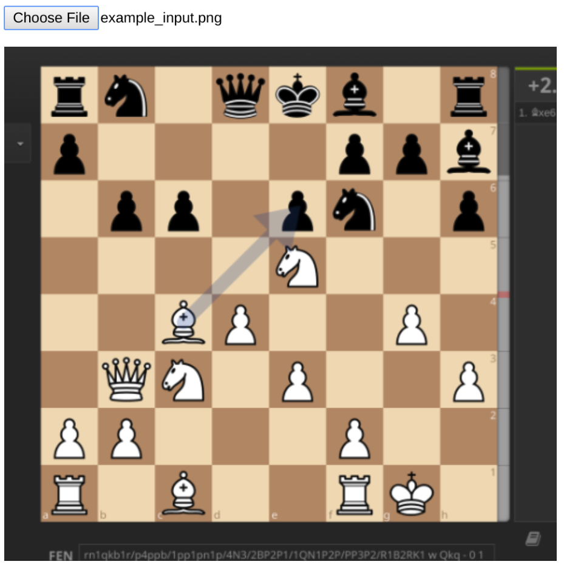
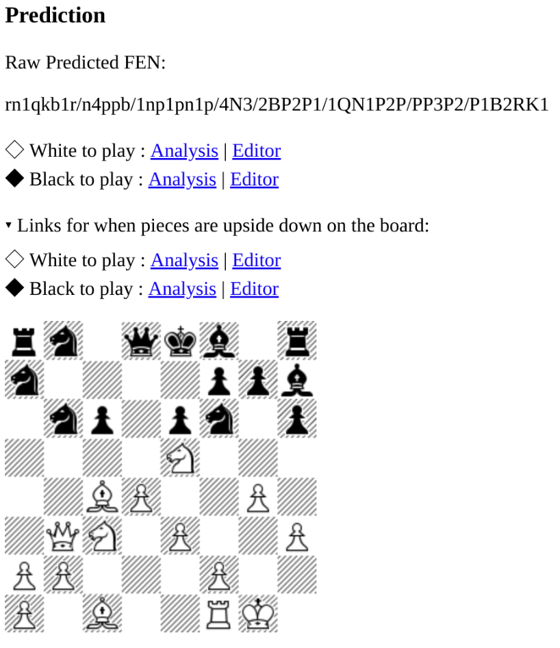
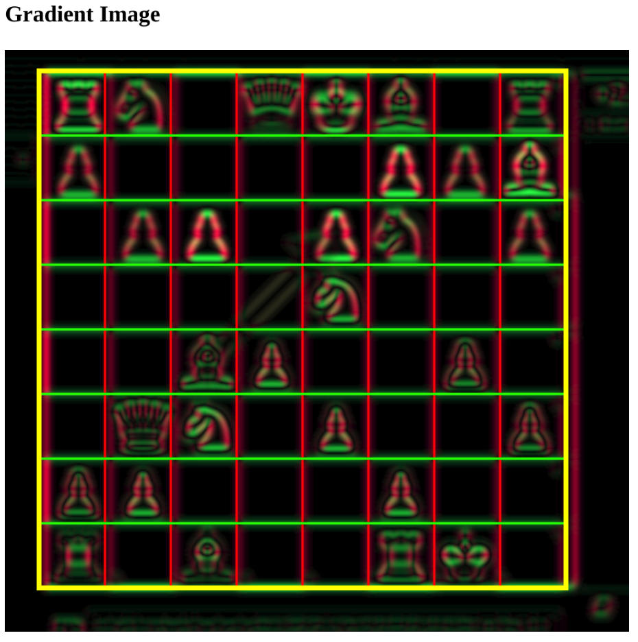
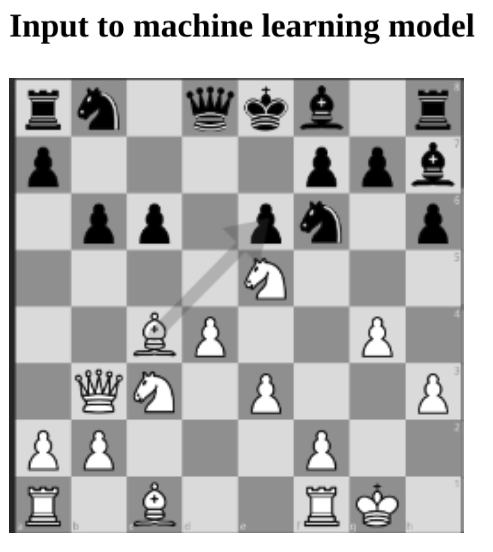

# Tensorflow Chessboard Prediction from Screenshots in HTML5

Given a screenshot which has an online chessboard in it somewhere, it finds the chessboard and predicts the layout of the pieces on it.

From  -> 

This uses the [Tensorflow Chessbot](https://github.com/Elucidation/tensorflow_chessbot/tree/chessfenbot) model. Unlike that repo this runs completely in javascript using TensorflowJs, all client-side.

There are two parts:

1. Finds and separates out the chessboard into a 256x256 px image containing the 32x32 tiles of the chessboard.
A very simplified chessboard detector is implemented. It requires the board to mostly fill up the image, be very well aligned and centered. In comparison chessfenbot can find aligned chessboards all around the image. [Issue #2](https://github.com/Elucidation/ChessboardScreenshotHtml5/issues/2)

The image is blurred and then the sobel gradients X and Y are used to find strong vertical and horizontal edges in the image corresponding to the chessboard. This is used to guess the bounds of the chessboard, and then generate a 256x256 px grayscale image as input for the tensorflow model.



2. Given 256x256px aligned chessboard image, run TensorflowJs model to predict pieces on it.




## Live demo

You can use this [live here](http://tetration.xyz/ChessboardScreenshotHtml5/)

## Running locally

A web server of some sort is needed to allow cross-origin sharing when running locally.

For example, one can use `http-server`.

```
http-server -o --cors -c-1 -a localhost
```
